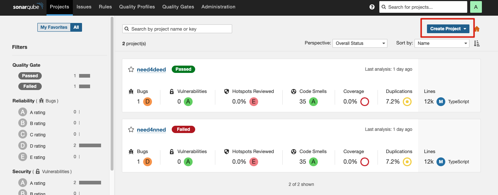
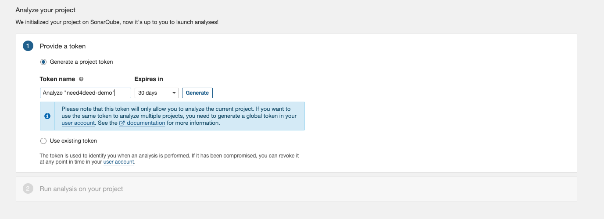

1. run the sonarqube with docker
```bash
  docker-compose up -d
```
2. open the sonarqube in the browser
```bash
  http://localhost:9001
```
3. create a new project manually and follow the instructions

4. generate a token and follow the instructions

5. add sonar-project.properties file in the root of the project and adjust the token and projectKey with your own settings
6. add `"sonar": "sonar-scanner"` under the scripts in package.json
7. run the sonar-scanner
```bash
  npm run sonar
```
